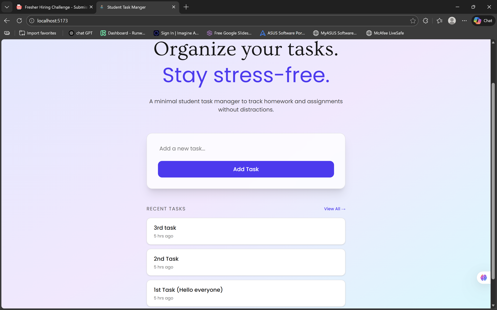

# 📚 Student Task Manager

## 1. Project Title & Goal
A full-stack Single Page Application (SPA) that allows students to add, view, and manage homework tasks in real time without refreshing the page.

---

## 2. Setup Instructions

> ⚠️ This project runs **entirely locally** and does **not use any external APIs**.

### Backend Setup
```bash
cd backend
npm install
node server.js
````

The backend server will start at:

```
http://localhost:5000
```

> ℹ️ The SQLite database file (`tasks.db`) is automatically created when the server starts.

---

### Frontend Setup

```bash
cd frontend
npm install
npm run dev
```

The frontend will be available at:

```
http://localhost:5173
```

---

## 3. The Logic (How I Thought)

### Why did I choose this approach?

* I chose a **React + Express** architecture to meet the SPA requirement where the UI updates without page reloads.
* The backend exposes simple REST APIs to keep responsibilities clearly separated.
* **SQLite** was selected because it satisfies the local storage requirement while keeping setup lightweight and dependency-free.
* The UI dynamically fetches and updates tasks to always reflect the database state.

### Hardest bug I faced & how I fixed it

The most challenging issue was handling **task timestamps** correctly.
Initially, newly added tasks displayed incorrect or invalid time values.

**Solution:**

* Ensured timestamps were generated using `CURRENT_TIMESTAMP` in SQLite
* Properly parsed the timestamp on the frontend
* Implemented a custom `timeAgo()` utility with edge-case handling

---

## 4. Output Screenshots

### Home Page Showing Added Tasks



> The screenshot shows a list of **at least 3 tasks**, as required in the problem statement.

### AllTasks Page Showing All Tasks


> The screenshot shows a list of **all tasks**,

---

## 5. Future Improvements

If I had 2 more days, I would:

* Add task completion (mark as done)
* Allow editing existing tasks
* Add better input validation and user feedback
* Improve error handling on both frontend and backend
* Deploy the application for easier access

```

